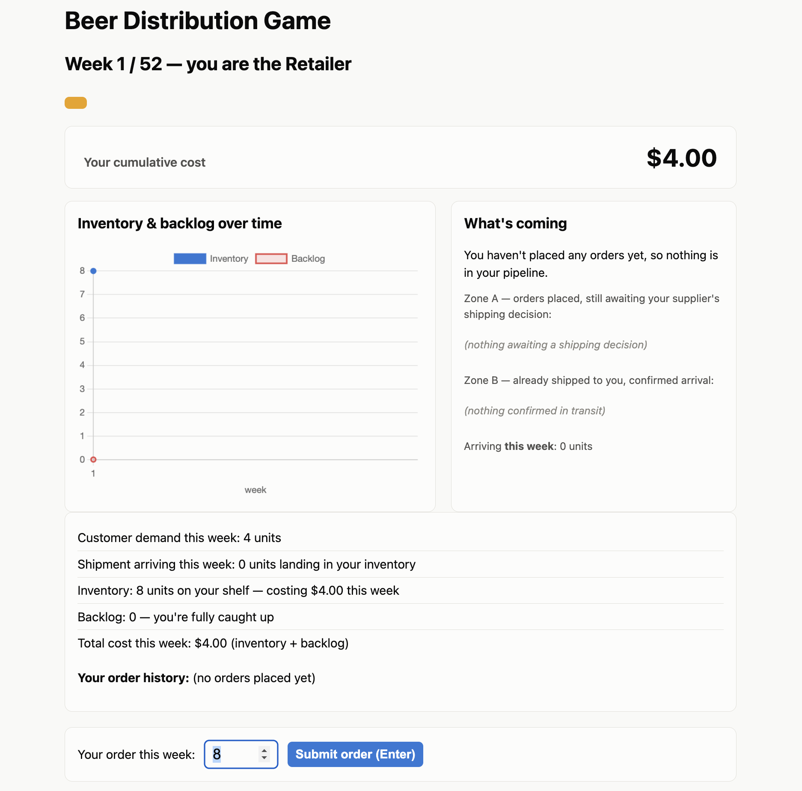
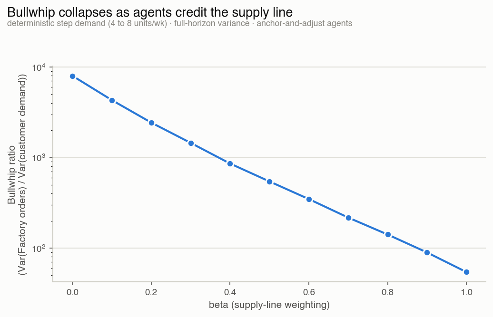
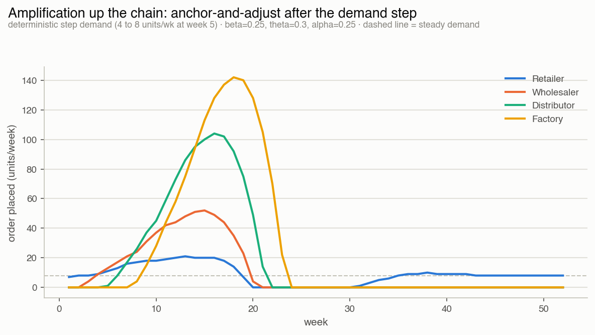
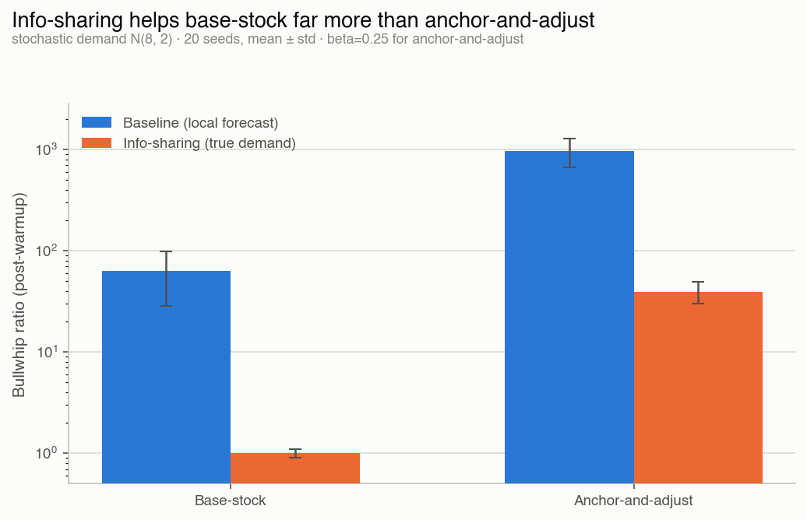
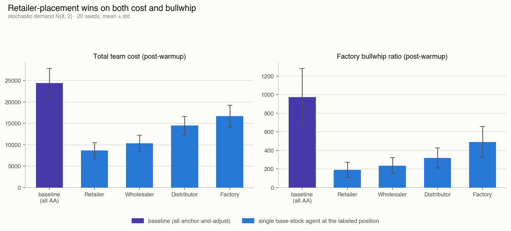

# Beer Distribution Game

An instrumented simulation of the Beer Distribution Game (Sterman's classic) that quantifies bullwhip amplification under three ordering policies and tests mitigations.

## ▶ Play the game

This repo now includes a browser-playable version of the Beer Distribution Game — you play one echelon of the supply chain and try to minimize cost, then see the bullwhip effect you couldn't observe during play.

**[▶ Play it live](https://wattwood1.github.io/Beer-Distribution-Game/)**



**How the game works:** you pick an echelon (Retailer, Wholesaler, Distributor, or Factory) and see only your own local information — your inventory, backlog, and orders, not the whole chain — the same restriction a real link in a supply chain faces. Each week you decide how much to order; the other three echelons run on the same validated policies used in the research below (base-stock or anchor-and-adjust). At the end, the game reveals the full-chain bullwhip you couldn't see during play and compares your total cost against a rational (base-stock) policy and a human-like (anchor-and-adjust) one at your exact position.

It's built on the same validated engine as the research, not a simplified reimplementation: the JS engine is verified byte-for-byte against the Python engine (52 weeks × 4 echelons × 10 fields, 2,080 values, 0 mismatches), so the game and the research findings below share the same underlying model.



## What it does

- Simulates a 4-echelon serial supply chain (Retailer → Wholesaler → Distributor → Factory) with order and shipping delays
- Implements three ordering policies: base-stock (rational benchmark), anchor-and-adjust (Sterman's behavioral model), and a learned policy (parameters optimized via scipy)
- Quantifies bullwhip amplification with multiple metrics
- Tests an information-sharing mitigation
- Validated across both deterministic step demand and stochastic demand (multi-seed, with confidence intervals)

## Key findings

**Bullwhip is governed by supply-line weighting: as agents better account for in-transit orders (beta 0→1), the bullwhip ratio falls ~150x.** See the hero figure above — beta sweeps from 0 (bullwhip ratio ~7,993) to 1 (~54), full-horizon, deterministic step demand.

**Anchor-and-adjust agents reproduce the classic amplifying oscillation — order swings grow at each stage upstream, Factory swinging hardest, from a demand that only steps 4→8.**



**Under stochastic demand, information-sharing helps the forecast-driven base-stock agent far more than the misperception-driven anchor-and-adjust agent (~63x vs. ~25x reduction) — this reverses the naive deterministic result, because deterministic demand has no variance to forecast.**



**A single rational agent's position matters: placing it at the demand-facing Retailer end gives the most leverage on both cost and bullwhip (verified across 20 seeds, decisive paired test).**



Figures 1–2 use deterministic step demand (full-horizon variance); figures 3–4 use stochastic demand (post-warmup variance, 20-seed mean ± std). The two regimes use different bullwhip-ratio conventions for principled reasons — see `experiments/sweeps.py` and `experiments/stochastic.py` — so values are not comparable across that boundary; only the qualitative findings are meant to be compared.

## The mechanism

Bullwhip is a structural property of the system, not a result of irrational agents. Even locally sensible ordering rules produce it; the amplification comes from delays and supply-line misperception, not from anyone behaving badly. This is the formal, instrumented version of the lesson the MIT Sloan Beer Game is famous for teaching: players in that game routinely blame each other for swings that the system's own delays and hidden demand signal actually cause.

## How to run

Install dependencies:

```bash
pip install -r requirements.txt
```

Run the test suite:

```bash
python3 -m pytest
```

Run the experiments:

```bash
python3 -m experiments.sweeps          # beta sweep (deterministic step demand) — the headline result
python3 -m experiments.mitigations     # information-sharing 2x2 + beta/forecast decomposition (deterministic)
python3 -m experiments.heterogeneous   # position-sensitivity experiment (deterministic)
python3 -m experiments.learned_policy  # scipy-optimized policy vs. base-stock and anchor-and-adjust
python3 -m experiments.stochastic      # beta sweep, mitigation, and position experiments re-run under stochastic demand, 20 seeds
python3 -m experiments.figures         # regenerate the four committed result figures into results/figures/
```

## Repo structure

```
env/                  simulation engine
  engine.py             weekly physics: the six-phase per-echelon step
  config.py              SimulationConfig, canonical setup, echelon names
  demand.py              deterministic step demand + stochastic demand generator

agents/                ordering policies
  interface.py           shared Observation/Agent protocol
  base_stock.py           rational order-up-to benchmark, pluggable demand forecaster
  anchor_adjust.py        Sterman's behavioral model (theta, alpha, beta)
  naive.py                pass-through test-only agent

experiments/           experiment runners and figure generation
  sweeps.py               beta sweep (deterministic)
  mitigations.py           information-sharing mitigation (deterministic)
  heterogeneous.py         position sensitivity (deterministic)
  learned_policy.py        scipy.optimize parameter search
  stochastic.py            beta sweep, mitigation, position — all re-run under stochastic demand
  figures.py               generates results/figures/*.png

tests/                 conservation, equilibrium, and correctness-gate tests
results/figures/       committed result figures (PNG)

js/                    the browser game -- a JS port of the engine, verified byte-for-byte against Python
  engine.js              same six-phase step as env/engine.py (0 mismatches across 2,080 values)
  round.js                Python-compatible round-half-to-even (a real JS/Python parity risk, not hypothetical)
  gameController.js       turn-based game loop with a structurally-enforced information restriction
  comparison.js           end-game comparison vs. base-stock/anchor-and-adjust at the player's position
  agents/                 JS ports of base-stock and anchor-and-adjust
  ui.js                   display layer: charts, pipeline visualization, how-to-play and end-screen copy
index.html, style.css  the playable game page itself (open via `python3 -m http.server`, or the live link above)
```

## How it was built

Built incrementally: the engine was validated by conservation, equilibrium, and analytical (near-zero-bullwhip) tests before any behavioral agent logic was added, so engine bugs and agent behavior were never debugged at the same time. Each subsequent result — the beta sweep, the mitigation, the position-sensitivity experiment — was re-verified under both deterministic step demand and stochastic demand, with a re-established correctness gate for the stochastic case before any stochastic experiment was trusted. Developed with Claude Code.

The browser game (`js/`) followed the same discipline: it's a faithful port of the Python engine, not a simplified reimplementation, and was verified byte-for-byte against the Python engine's own output before any game logic or UI was built on top of it. Only after that gate passed did the turn-based game loop, the information restriction, and the visual/explanation layers get built.

## Limitations

The behavioral agents (anchor-and-adjust) are a model of human ordering behavior, not human subjects — they reproduce Sterman's documented pattern but aren't validated against new experimental data here. Results are reported for two specific demand processes (a deterministic step and a stationary stochastic process); other demand patterns (seasonal, trending, correlated) are untested. The "learned" policy uses direct parameter optimization (scipy's differential evolution) over the anchor-and-adjust functional form, not a general-purpose deep RL agent — it finds the best parameters within that structure, not the best policy in an unconstrained policy space. The supply chain itself is a 4-echelon serial simplification; real distribution networks are typically non-serial, multi-sourced, and capacity-constrained.
